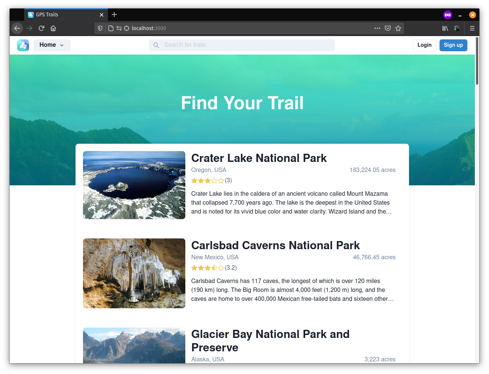
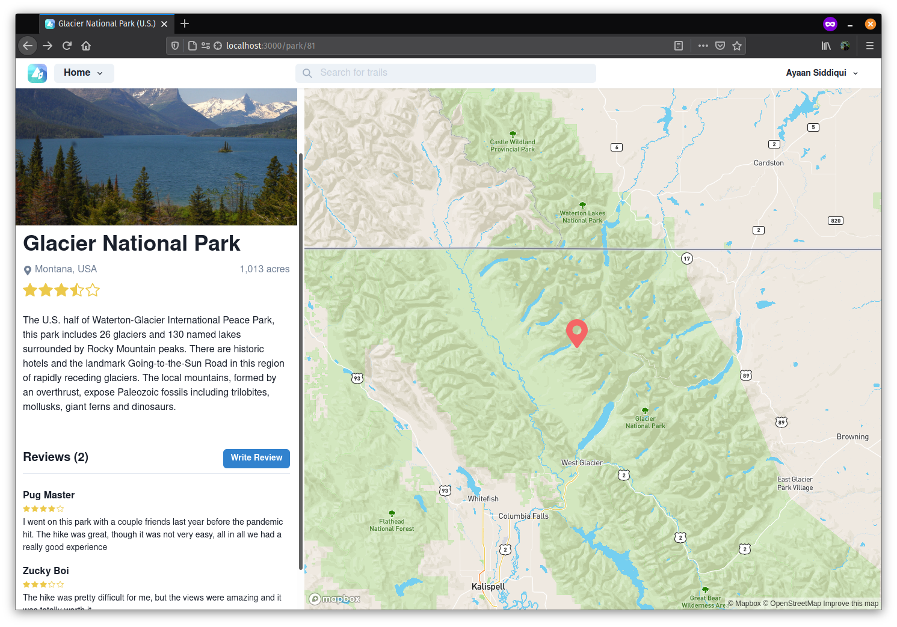
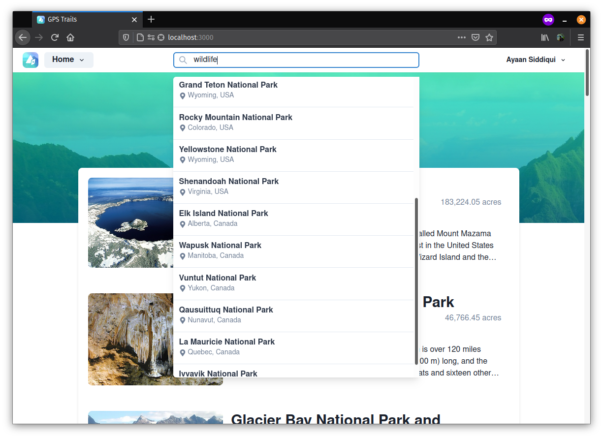

<h1> GPS Trails</h1>

GPS  Trails  is  a  user-centralized web-application that  is  designed  to  foster  a  new community of nature enthusiasts. Some of its features include allowing users to input their own trial discoveries and reviewing previous trails already in the database.

<p align="center">
    
    <small><i>Homepage</i></small>
</p>
<br />

## Implementation
GPS Trails is implemented using 3 stand-alone  components: React with Next.js for the client facing front-end, NestJS as the backend API server that talks to a MySQL database to store and fetch trail and user related data. Additionally, we make use of the Mapbox API in order to serve a custom interactable map interface.

## Pages
<p align="center">
    
    <small><i>Emplore page on <a href="https://en.wikipedia.org/wiki/Glacier_National_Park_(U.S.)">Glacier National Park</a></i></small>
</p>
<br />
<p align="center">
    
    <small><i>Real-time search functionality</i></small>
</p>

## Set Up
Since this project makes use of separate components to work, the set up requires setting up a database, api server, initializing data from the web scraper, and finally, setting up the frontend Next.js server.
### Clone project
```
$ git clone https://github.com/ayaanqui/gps-trails.git
$ cd gps-trails
```

### Create database
Since this project relies on MySQL as the database, all dependencies are for MySQL. To ensure that the project runs properly create an empty database.
`CREATE DATABASE gps_trails;`

### Setting Up the API Server
```
$ cd gps-trails/api/
```
### Setting Up TypeORM Config Files
Now, we need to ensure that TypeORM is able to find the connection strings to connect to the database properly

1. Create a file named `ormconfig.json` in the root of `gps-trails/api/` directory
2. Paste and fill out the contents with the appropriate information
```json
{
  "type": "mysql",
  "host": "localhost",
  "port": 3306,
  "username": "root",
  "password": "root",
  "database": "gps_trails",
  "entities": ["dist/**/*.entity{.ts,.js}"],
  "synchronize": true
}
```
_*The only fields that need to be changed are `username`, `password`, and `database`. Anything other than these fields should not be changed._

After this we will need to make sure that all the dependencies are installed for the server to start up properly.

```
$ npm install
```
Once this step is complete, run the command `npm start`. If everything compiles and runs properly, you should be able to access `localhost:3000`, and you should see the following message on the console:
```
[Nest] 430432   - 05/16/2021, 4:32:14 PM   [NestFactory] Starting Nest application...
[Nest] 430432   - 05/16/2021, 4:32:14 PM   [InstanceLoader] TypeOrmModule dependencies initialized
....
```
With that, the server should be up, and ready to for use. 

### Scraping the web for data
Even though our server is ready, there is currently no data within the database for the service to work. Therefore, we will use the web scraper to scrape Wikipedia pages and load this data on the database and API server.

__Important:__ *Make sure the API server is active and listening on port `3001` before running the web scraper.*

```
$ cd gps-trails/park-data-crawler
```
```
$ npm install
$ node us_parks.js
$ node canada_parks.js
```

### Setting Up The Frontend
```
$ cd gps-trails/frontend
$ npm install
$ npm run dev
```
With this the frontend server should start on port `3000`, ready to be used. To make sure that everything is working as inteded, verify that ports `3000` (Next.js development server), `3001` (API server), and `3306` (MySQL server) are all running at the same time.