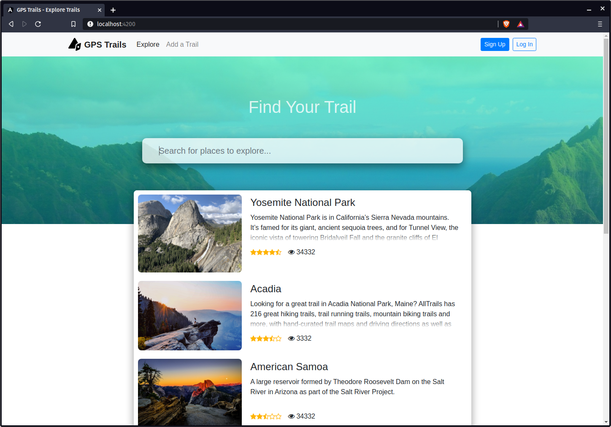

<h1> GPS Trails</h1>

GPS  Trails  is  a  user-centralized web-application that  is  designed  to  foster  a  new community of nature enthusiasts. Some of its features include allowing users to input their own trial discoveries and reviewing previous trails already in the database.

<p></p>
<br />

## Implementation
GPS Trails is implemented using 3 stand-alone  components: Angular for the client facing front-end, NestJS as the backend API server that talks to a MySQL database to store and fetch trail and user related data. Additionally, we make use of the Mapbox API in order to serve a custom interactable map interface.

## Set Up
### Clone project
```
$ git clone https://github.com/ayaanqui/gps-trails.git
$ cd gps-trails
```

### Create database
Since this project relies on MySQL as the database, all dependencies are for MySQL. To ensure that the project runs properly create an empty database.
`CREATE DATABASE gps-trails;`

### Setting Up the API Server
```
$ cd gps-trails/api/
```
After this we will need to make sure that all the dependencies are installed for the server to start up properly.

```
$ npm install
```
Once this step is complete, run the command `npm start`. If everything compiles and runs properly, you should be able to access `localhost:3000`, and you should see the following message on the console:
```
[Nest] 430432   - 05/16/2021, 4:32:14 PM   [NestFactory] Starting Nest application...
[Nest] 430432   - 05/16/2021, 4:32:14 PM   [InstanceLoader] TypeOrmModule dependencies initialized
....
```
With that, the server should be up, and ready to be used for our frontend Angular service.

### Setting Up The Frontend
```
$ cd gps-trails/frontend
$ npm install
$ npm start
```
Running this should open up a new browser tab with the GPS Trails homepage, ready to be used.